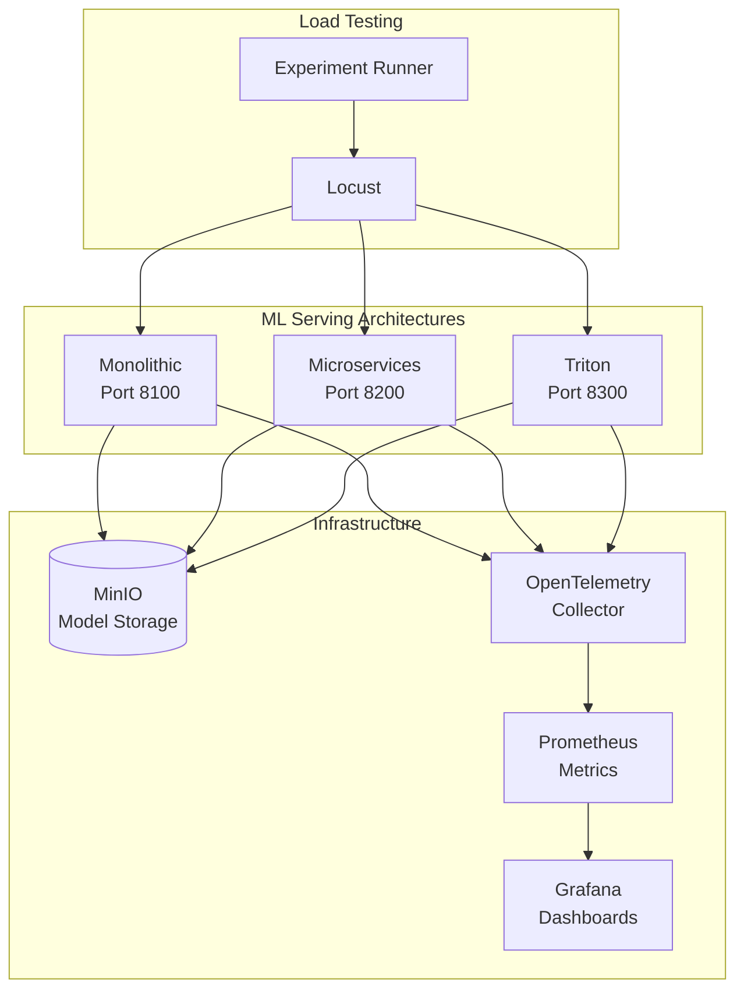

# Inference Arena

**A Comparative Study of ML Model Serving Architectures**

[](https://github.com/matthewhoung/inference-arena/actions/workflows/ci.yml)
[](https://www.python.org/downloads/)
[](docs/SETUP.md#test-coverage)
[](https://opensource.org/licenses/MIT)
[](https://github.com/psf/black)
[](https://github.com/astral-sh/ruff)

> Master's Thesis Project - Matthew Hong

---

## Table of Contents

- [Overview](#overview)
- [System Architecture](#system-architecture)
- [Architectures](#architectures)
- [Quick Start](#quick-start)
- [Project Structure](#project-structure)
- [Testing](#testing)
- [Documentation](#documentation)
- [License](#license)

---

## Overview

Inference Arena is a benchmark framework for comparing ML model serving architectures under controlled conditions. It evaluates three architectural approaches to deploying a two-stage computer vision pipeline (object detection + image classification) and measures their performance, resource efficiency, and operational trade-offs.

The framework provides reproducible experiments with pre-registered hypotheses, centralized configuration, and comprehensive observability. All experimental parameters are defined in a single `experiment.yaml` file, ensuring consistent conditions across all tests.

This project demonstrates production engineering practices including containerized deployments, gRPC microservices communication, infrastructure-as-code, and comprehensive test coverage.

---

## System Architecture



---

## Architectures

Three architectural approaches are benchmarked using identical ML models and preprocessing logic:

| Architecture | Design | Key Characteristics |
|--------------|--------|---------------------|
| **Monolithic** | Single container | Simple deployment, all processing in one service |
| **Microservices** | Detection + Classification services | gRPC fan-out, independent scaling |
| **Triton** | Gateway + NVIDIA Triton Server | Optimized inference runtime, batching support |

Each architecture README contains detailed diagrams, port configurations, and deployment instructions:

- [Monolithic Architecture](architectures/monolithic/README.md)
- [Microservices Architecture](architectures/microservices/README.md)
- [Triton Architecture](architectures/triton/README.md)

---

## Quick Start

### Prerequisites

- **Docker** and **Docker Compose**
- **Python 3.11+**
- **[uv](https://docs.astral.sh/uv/)** - Modern Python package manager

```bash
# Install uv (if not installed)
curl -LsSf https://astral.sh/uv/install.sh | sh
```

### Setup

```bash
# Clone the repository
git clone https://github.com/matthewhoung/inference-arena.git
cd inference-arena

# Complete setup (install deps, start infrastructure, download data, upload models)
make setup

# Run tests
make test
```

### Run an Architecture

```bash
# Start infrastructure (MinIO, Prometheus, Grafana)
make start-infra

# Start an architecture (choose one)
make start-mono     # Monolithic   - http://localhost:8100
make start-micro    # Microservices - http://localhost:8200
make start-triton   # Triton        - http://localhost:8300

# Run a quick load test
make test-quick

# Stop everything
make stop-all
```

### Service Endpoints

| Service | URL | Credentials |
|---------|-----|-------------|
| MinIO Console | http://localhost:9001 | minioadmin / minioadmin |
| Prometheus | http://localhost:9090 | - |
| Grafana | http://localhost:3000 | admin / admin |

For detailed setup instructions, see [docs/SETUP.md](docs/SETUP.md).

---

## Project Structure

```
inference-arena/
├── experiment.yaml          # Single source of truth for all parameters
├── Makefile                 # Common commands (run: make help)
├── pyproject.toml           # Python dependencies and tool config
│
├── architectures/           # Three ML serving architectures
│   ├── monolithic/          # Architecture A: Single container
│   ├── microservices/       # Architecture B: Detection + Classification
│   └── triton/              # Architecture C: Triton Inference Server
│
├── src/shared/              # Shared Python library
│   ├── config/              # Configuration loading
│   ├── processing/          # Image preprocessing pipelines
│   ├── model/               # Model registry and export
│   ├── validation/          # Container and port validation
│   └── exceptions.py        # Exception hierarchy
│
├── infrastructure/          # Docker infrastructure
│   ├── docker-compose.infra.yml
│   ├── grafana/             # Dashboard provisioning
│   ├── prometheus/          # Scrape configuration
│   └── otel/                # OpenTelemetry config
│
├── experiments/             # Load testing framework
│   ├── locustfile.py        # Locust user behavior
│   └── runner.py            # Experiment orchestration
│
├── scripts/                 # Setup and utility scripts
│   ├── setup/               # Environment and data setup
│   └── models/              # Model export and upload
│
├── tests/                   # Unit and integration tests
└── docs/                    # Documentation
```

---

## Testing

**Test Coverage:** 88% (threshold: 80%)

### Development Testing

| Command | Description |
|---------|-------------|
| `make test` | Run all tests with coverage |
| `make test-fast` | Run tests excluding slow markers |
| `make test-unit` | Unit tests only (no services needed) |
| `make lint` | Run linters (ruff + mypy) |
| `make format` | Format code (black + ruff) |

### Load Testing

| Command | Description |
|---------|-------------|
| `make test-quick` | Quick test (10 users, 1 run) |
| `make test-arch ARCH=mono` | Test one architecture with all load levels |
| `make test-matrix` | Full experiment matrix (63 tests) |
| `make test-web` | Start Locust web UI |

For complete testing documentation, see [docs/SETUP.md](docs/SETUP.md#testing).

---

## Documentation

### Getting Started

- [SETUP.md](docs/SETUP.md) - Development environment setup and prerequisites
- [ENVIRONMENT.md](docs/ENVIRONMENT.md) - Environment variables and configuration

### Experiment Documentation

- [EXPERIMENTS.md](docs/EXPERIMENTS.md) - Experiment protocol and load testing framework
- [EXPERIMENT_CONFIG.md](docs/EXPERIMENT_CONFIG.md) - Complete experiment.yaml reference

### Reference

- [TROUBLESHOOTING.md](docs/TROUBLESHOOTING.md) - Common issues and solutions
- [CHANGELOG.md](docs/CHANGELOG.md) - Breaking changes and version history

### Technical Guides

- [ONNX_UPGRADE.md](docs/ONNX_UPGRADE.md) - ONNX IR version constraints
- [YOLO_EXPORT.md](docs/YOLO_EXPORT.md) - YOLOv5 export settings

---

## License

This project is licensed under the MIT License - see the [LICENSE](LICENSE) file for details.

---

## Acknowledgments

- NVIDIA Triton Inference Server team
- Ultralytics YOLOv5 team
- COCO dataset maintainers

---

*Single Source of Truth: [experiment.yaml](experiment.yaml)*
