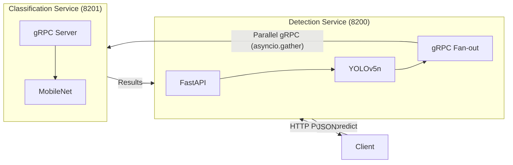

# Architecture B: Microservices

Two independent services communicating via gRPC, with async fan-out for parallel classification of detected objects.

## Architecture Diagram



## Key Characteristics

- **Two-Service Architecture**: Detection and Classification as separate microservices
- **gRPC Inter-Service Communication**: Efficient binary protocol for service-to-service calls
- **Parallel Classification Fan-out**: `asyncio.gather` enables concurrent classification of multiple detections
- **Independent Scaling**: Each service can be scaled independently
- **Lossless Data Transport**: Raw RGB bytes transported via gRPC (no compression artifacts)
- **Resource Allocation**: 2 vCPU, 4GB memory per service (4 vCPU total per `experiment.yaml`)

## Port Configuration

| Service | Port | Protocol | Description |
|---------|------|----------|-------------|
| Detection | 8200 | HTTP | External API endpoint |
| Classification | 8201 | gRPC | Internal service (not exposed externally) |

Port assignments defined in `experiment.yaml` under `services` section.

## Directory Structure

```
microservices/
├── detection/                   # Detection service
│   ├── app/
│   │   ├── __init__.py
│   │   ├── main.py              # HTTP endpoints (/predict, /health)
│   │   ├── config.py            # Service configuration
│   │   ├── grpc_client.py       # gRPC client for Classification
│   │   ├── inference.py         # YOLOv5n detection pipeline
│   │   ├── models.py            # Pydantic response models
│   │   └── logger.py            # Structured logging
│   └── Dockerfile
├── classification/              # Classification service
│   ├── app/
│   │   ├── __init__.py
│   │   ├── main.py              # gRPC server entry point
│   │   ├── config.py            # Service configuration
│   │   ├── servicer.py          # gRPC servicer implementation
│   │   ├── inference.py         # MobileNetV2 classification
│   │   └── logger.py            # Structured logging
│   └── Dockerfile
├── docker-compose.yml           # Container orchestration
└── init_microservices_models.py # Init container model download script
```

## Service Communication Flow

1. **Client Request**: HTTP POST to Detection service with image
2. **Object Detection**: YOLOv5n identifies objects in image
3. **Parallel Fan-out**: For each detection, crop is sent to Classification service via gRPC
4. **Classification**: MobileNetV2 classifies each crop concurrently
5. **Response Aggregation**: Detection service combines results and returns JSON

The `asyncio.gather` pattern enables parallel classification calls, masking gRPC latency during fan-out operations.

## Running This Architecture

### Start

```bash
make start-micro
```

This command:
1. Starts infrastructure (MinIO, Prometheus, Grafana)
2. Downloads models from MinIO via init container
3. Launches Classification service first (gRPC server)
4. Launches Detection service after Classification is healthy

### Stop

```bash
make stop-all
```

### Health Check

```bash
curl http://localhost:8200/health
```

Expected response:
```json
{"status": "healthy", "models_loaded": true}
```

### Predict Endpoint

```bash
curl -X POST "http://localhost:8200/predict" \
  -H "Content-Type: multipart/form-data" \
  -F "file=@path/to/image.jpg"
```

## Model Loading

Models are downloaded by an init container before services start:

1. **Init Container** (`microservices-init`): Downloads models from MinIO
2. **Shared Volume**: Models stored in `inference-arena-microservices-models` Docker volume
3. **Classification Startup**: Loads MobileNetV2, starts gRPC server
4. **Detection Startup**: Loads YOLOv5n, connects to Classification service

## Service Dependencies

```
microservices-init (downloads models)
       │
       ▼
classification (gRPC server, port 8201)
       │
       ▼ (depends_on: service_healthy)
detection (HTTP + gRPC client, port 8200)
```

## Dependencies

- Infrastructure services (MinIO, Prometheus, Grafana) via `make infra-up`
- Models uploaded to MinIO bucket via `make models-setup`
- gRPC proto definitions in `src/shared/proto/inference.proto`
