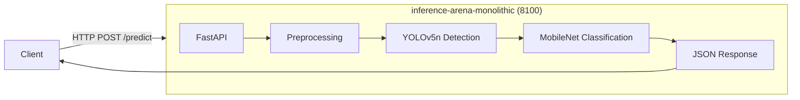

# Architecture A: Monolithic

Single container consolidating preprocessing, object detection, and image classification in a unified inference pipeline.

## Architecture Diagram



## Key Characteristics

- **Single Container Deployment**: All inference logic runs in one process
- **Sequential Processing Pipeline**: Preprocessing, detection, and classification execute in sequence
- **Shared Memory**: Models loaded once, inference uses in-memory numpy arrays
- **No Network Overhead**: All pipeline stages communicate via function calls
- **Resource Allocation**: 2 vCPU, 4GB memory (per `experiment.yaml`)

## Port Configuration

| Port | Protocol | Description |
|------|----------|-------------|
| 8100 | HTTP | External API endpoint |

Port assignments defined in `experiment.yaml` under `services` section.

## Directory Structure

```
monolithic/
├── app/                        # FastAPI application
│   ├── __init__.py
│   ├── main.py                 # HTTP endpoints (/predict, /health)
│   ├── config.py               # Service configuration
│   ├── inference.py            # Detection + classification pipeline
│   ├── models.py               # Pydantic response models
│   └── logger.py               # Structured logging
├── docker-compose.yml          # Container orchestration
├── Dockerfile                  # Container image definition
└── init_monolith_models.py     # Init container model download script
```

## Running This Architecture

### Start

```bash
make start-mono
```

This command:
1. Starts infrastructure (MinIO, Prometheus, Grafana)
2. Downloads models from MinIO via init container
3. Launches the monolithic service

### Stop

```bash
make stop-all
```

### Health Check

```bash
curl http://localhost:8100/health
```

Expected response:
```json
{"status": "healthy", "models_loaded": true}
```

### Predict Endpoint

```bash
curl -X POST "http://localhost:8100/predict" \
  -H "Content-Type: multipart/form-data" \
  -F "file=@path/to/image.jpg"
```

## Model Loading

Models are downloaded by an init container before the service starts:

1. **Init Container** (`monolithic-init`): Downloads YOLOv5n and MobileNetV2 ONNX models from MinIO
2. **Shared Volume**: Models stored in `inference-arena-monolithic-models` Docker volume
3. **Service Startup**: Main container verifies models exist before accepting requests

This approach ensures model loading time is excluded from latency measurements.

## Dependencies

- Infrastructure services (MinIO, Prometheus, Grafana) via `make infra-up`
- Models uploaded to MinIO bucket via `make models-setup`
