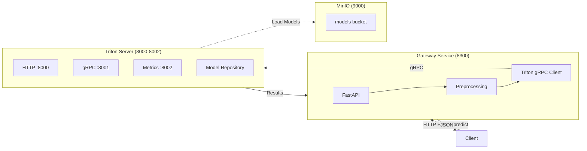

# Architecture C: NVIDIA Triton Inference Server

Gateway service orchestrating inference requests to NVIDIA Triton Inference Server, with models loaded from S3-compatible object storage (MinIO).

## Architecture Diagram



## Key Characteristics

- **NVIDIA Triton Inference Server**: Production-grade inference server with optimized C++ runtime
- **S3-Compatible Model Repository**: Models loaded from MinIO bucket
- **Dynamic Batching Capability**: Optional request batching for throughput optimization
- **Multiple Model Versions**: Triton supports serving multiple versions simultaneously
- **Gateway Orchestration**: FastAPI gateway handles preprocessing and response formatting
- **Async gRPC Client**: `tritonclient.grpc.aio` for non-blocking inference calls
- **Resource Allocation**: 2 vCPU, 4GB memory per container (4 vCPU total per `experiment.yaml`)

## Port Configuration

| Service | Port | Protocol | Description |
|---------|------|----------|-------------|
| Gateway | 8300 | HTTP | External API endpoint |
| Triton HTTP | 8000 | HTTP | Triton HTTP inference (internal) |
| Triton gRPC | 8001 | gRPC | Triton gRPC inference (internal) |
| Triton Metrics | 8002 | HTTP | Prometheus metrics (internal) |

Port assignments defined in `experiment.yaml` under `services` section.

## Directory Structure

```
triton/
├── gateway/                    # FastAPI gateway service
│   ├── app/
│   │   ├── __init__.py
│   │   ├── main.py             # HTTP endpoints (/predict, /health)
│   │   ├── config.py           # Service configuration
│   │   ├── pipeline.py         # Detection + classification orchestration
│   │   ├── triton_client.py    # Async Triton gRPC client
│   │   ├── models.py           # Pydantic response models
│   │   └── logger.py           # Structured logging
│   └── Dockerfile
├── docker-compose.yml          # Container orchestration
├── init_triton_models.py       # Init container model download script
└── __init__.py                 # Python package marker
```

## Model Repository

Triton loads models from a structured repository with the following layout:

```
models/
├── yolov5n/
│   ├── 1/
│   │   └── model.onnx
│   └── config.pbtxt
└── mobilenetv2/
    ├── 1/
    │   ├── model.onnx
    │   └── model.onnx.data
    └── config.pbtxt
```

### Model Configuration

Each model has a `config.pbtxt` defining:
- Input/output tensor shapes and types
- Instance group (CPU execution)
- Threading parameters (matching `experiment.yaml` ONNX runtime settings)
- Optional dynamic batching settings

## Dynamic Batching

Triton supports dynamic batching for throughput optimization:

| Mode | `TRITON_BATCHING` | Description |
|------|-------------------|-------------|
| Disabled | `false` (default) | Sequential request processing |
| Enabled | `true` | Batch requests for parallel inference |

Batching parameters (when enabled):
- `max_batch_size`: 8
- `preferred_batch_size`: [4, 8]
- `max_queue_delay_microseconds`: 5000

## Running This Architecture

### Start

```bash
make start-triton
```

This command:
1. Starts infrastructure (MinIO, Prometheus, Grafana)
2. Downloads models and config.pbtxt files from MinIO via init container
3. Launches Triton server (waits for model loading)
4. Launches Gateway service after Triton is healthy

### Stop

```bash
make stop-all
```

### Health Check

Gateway health:
```bash
curl http://localhost:8300/health
```

Triton health:
```bash
curl http://localhost:8000/v2/health/ready
```

Expected response:
```json
{"status": "healthy", "models_loaded": true}
```

### Predict Endpoint

```bash
curl -X POST "http://localhost:8300/predict" \
  -H "Content-Type: multipart/form-data" \
  -F "file=@path/to/image.jpg"
```

## Model Loading

Models are downloaded by an init container before services start:

1. **Init Container** (`triton-init`): Downloads models and config.pbtxt from MinIO
2. **Shared Volume**: Models stored in `inference-arena-triton-models` Docker volume
3. **Triton Startup**: Loads models from volume, exposes inference endpoints
4. **Gateway Startup**: Connects to Triton gRPC endpoint

## Service Dependencies

```
triton-init (downloads models + config.pbtxt)
       │
       ▼
triton-server (Triton Inference Server, ports 8000-8002)
       │
       ▼ (depends_on: service_healthy)
triton-gateway (HTTP gateway, port 8300)
```

## Infrastructure Notes

- **Triton Image**: Official NVIDIA image `nvcr.io/nvidia/tritonserver:24.08-py3`
- **CPU-Only Mode**: `ORT_DISABLE_ALL_EPS_EXCEPT_CPU=1` forces ONNX Runtime CPU execution
- **Model Upload**: Run `make models-setup` to upload models to MinIO with Triton-compatible structure

## Dependencies

- Infrastructure services (MinIO, Prometheus, Grafana) via `make infra-up`
- Models uploaded to MinIO bucket via `make models-setup`
- Triton-compatible model repository structure with config.pbtxt files
